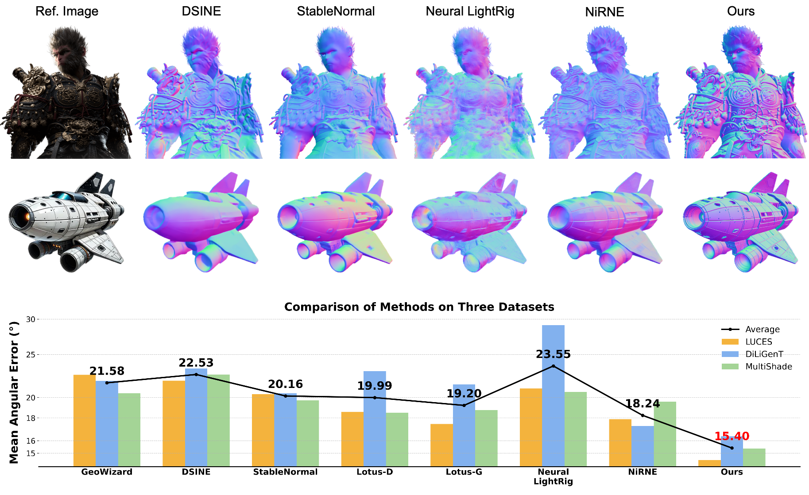

#  (RoSE) Monocular Normal Estimation via Shading Sequence Estimation

  <a href="https://zongrui.page/">Zongrui Li</a>1* ·
  <a href="https://openreview.net/profile?id=%7EXinhua_Ma1">Xinhua Ma</a>1* ·
  <a href="https://mhh0318.github.io/">Minghui Hu</a>1 ·
  <a href="https://yunqing-me.github.io/">Yunqing Zhao</a>2 ·
  <a href="https://yingchen001.github.io/">Yingchen Yu</a>2 ·
  <a href="https://q-zh.github.io/">Qian Zheng</a>3 ·
  <a href="https://scholar.google.com/citations?user=XlQP0GIAAAAJ&hl=en">Chang Liu</a>4† ·
  <a href="https://personal.ntu.edu.sg/exdjiang/">Xudong Jiang</a>1 ·
  <a href="https://songbai.site/">Song Bai</a>2

<h4 align="center">
  1Nanyang Technological University, 2ByteDance, 3Zhejiang University, 4Shanghai University of Finance and Economics
</h4>

  *Equal Contribution, †Corresponding Author

<h3 align="center">ICLR 2026 (Oral)</h3>

<h3 align="center">
  <a href="https://arxiv.org/abs/2602.09929">arXiv</a> | 
  <a href="https://xinhua694.github.io/RoSE.github.io/">Project Page</a> | 
  <a href="#">Dataset</a>
</h3> 

> We present <b>RoSE</b>, a method using a <b>video generative model</b> for <b>monocular normal map estimation</b>, built on a new paradigm that reformulates normal estimation as a <b>shading sequence estimation</b> task.

Code for "Monocular Normal Estimation via Shading Sequence Estimation". Coming Soon.